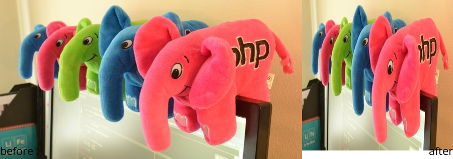
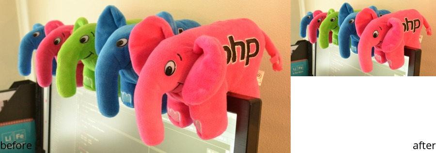
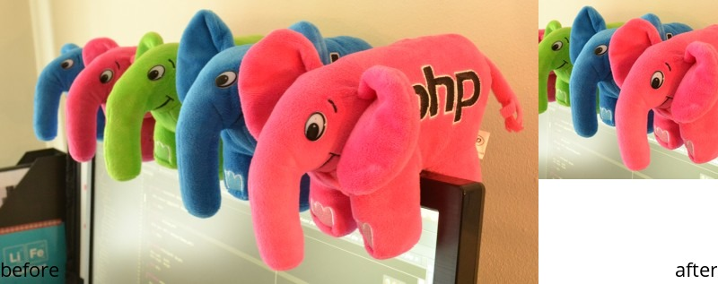
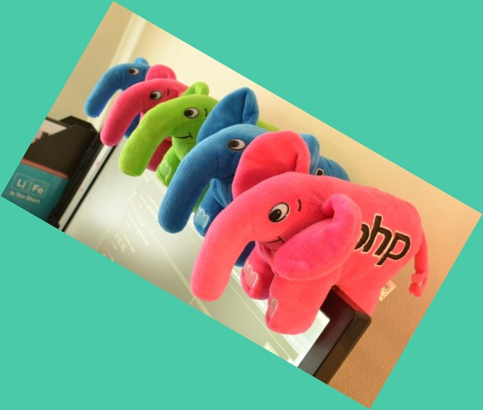

Basic Operations
================

This page covers basic image manipulation operations, such as load/output, thumbnail, crop, resize etc.

Load and Output
---------------

To load an existent image you can pass the path to the Imanee object on instantiation, or you can load the image
after creating the object.

The output method returns the image as a string, so don't forget to set the headers to the image type you are outputting.

.. code-block:: php

    header("Content-type: image/jpeg");

    $imanee = new Imanee('path/to/myimage.jpg'); //using the shortcut

    echo $imanee->output();

.. code-block:: php

    header("Content-type: image/jpeg");

    $imanee = new Imanee();
    $imanee->load('path/to/myimage.jpg'); // loading the image after the object is created

    echo $imanee->output();

Resizing Images
---------------

Resizing images with Imanee is pretty straightforward. You can either use a bestfit or force the exact width and height for the resizing.

``Imanee Imanee::resize($width, $height, $bestfit = true)``

Keeping Proportion
##################

The resize works in a similar way to the ``thumbnail`` method. By default, the image will be resized to fit inside the provided dimensions, keeping its original proportions.

.. code-block:: php

    $res_jpg  = __DIR__ . '/resources/img01.jpg';

    header("Content-type: image/jpg");

    $imanee = new Imanee($res_jpg);

    echo $imanee->resize(300, 300)
            ->output();

.. image:: img/resize01.jpg

Force resulting size
####################
If you want to force the resulting size to the specified width and height, you need to provide the extra argument ``$bestfit = false``. Be aware that this might change the image proportions.

.. code-block:: php

    $res_jpg  = __DIR__ . '/resources/img01.jpg';

    header("Content-type: image/jpg");

    $imanee = new Imanee($res_jpg);

    echo $imanee->resize(300, 300, false)
            ->output();

Creating Image Thumbnails
-------------------------

``Imanee Imanee::thumbnail($width, $height, $crop = false)``

Creating a thumbnail to fit an area
###################################

The ``thumbnail`` method will generate a proportional thumbnail in a size that can fit in the specified dimensions. The result is identical to the ``resize`` method.

.. code-block:: php

    $res_jpg = __DIR__ . '/../resources/img01.jpg';

    header("Content-type: image/jpg");

    $imanee = new Imanee($res_jpg);

    echo $imanee->thumbnail(300, 300)
                ->output();

Creating a cropped thumbnail
############################

The ``thumbnail`` method can receive an additional argument that will create the thumbnail using a strict size, by cropping the image to keep proportion. This is the main difference
between the ``resize`` and ``thumbnail`` methods - it's recommended that you use ``thumbnail`` when dealing with exact image sizes, since it won't change proportion while
using all space that is available.

In order to create a square thumbnail, for instance, you just need to provide same width and height and the additional ``crop = true`` argument:

.. code-block:: php

    $res_jpg = __DIR__ . '/../resources/img01.jpg';

    header("Content-type: image/jpg");

    $imanee = new Imanee($res_jpg);

    echo $imanee->thumbnail(300, 300, true)
                ->output();

Rotating images
---------------

Use the method ``rotate`` to rotate the image resource in the given degrees:

.. code-block:: php

    $res_jpg = __DIR__ . '/../resources/img01.jpg';

    header("Content-type: image/jpg");
    $imanee = new Imanee($res_jpg);

    $imanee->rotate(30,'#4ACAA8');

    echo $imanee->output();

The first parameter represents the amount of degrees to rotate the image. Negative values will rotate the image anti-clockwise
The second parameter defines the background color to use for filling the empty spaces. Dsefault is transparent.
Allowed values are documented `in the php documentation <http://php.net/manual/en/imagickpixel.construct.php>`_
It will render as black for jpg format (use png if you want it transparent)

.. note::
It will render as black for jpg format (use png if you want it transparent)

Saving Images to Disk
---------------------

Saving images to disk is done with the ``write`` method.

``Imanee Imanee::write($path, $jpeg_quality = null)``

The format will be decided based on the extension used for the filename. The second parameter is only used for JPG files, and indicates the quality, up to 100 (100 = no compression, higher quality and bigger file).

Examples
########

Saving as JPG:

.. code-block:: php

    $res_jpg = __DIR__ . '/../resources/img01.jpg';

    header("Content-type: image/jpg");

    $imanee = new Imanee($res_jpg);

    $imanee
    ->thumbnail(300, 300)
    ->write('path/to/save.jpg', 90);

Saving as PNG:

.. code-block:: php

    $res_jpg = __DIR__ . '/../resources/img01.jpg';

    header("Content-type: image/jpg");

    $imanee = new Imanee($res_jpg);

    $imanee
    ->thumbnail(300, 300)
    ->write('path/to/save.png');