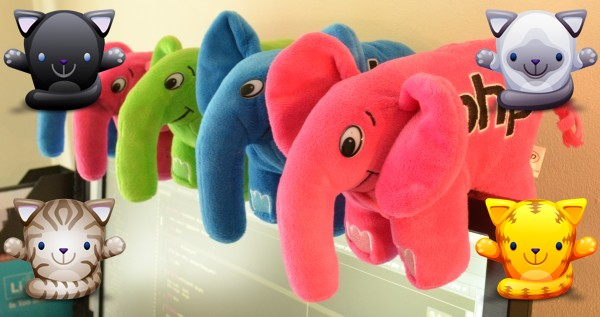
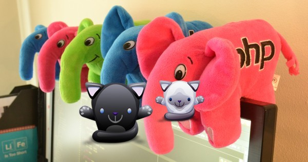

Creating Collages
=================

You can easily create collages (image composition) using either relative or absolute positioning.

Using relative positioning
--------------------------

``Imanee Imanee::placeImage($image, $place_constant = Imanee::IM_POS_TOP_LEFT, $width = null, $height = null, $transparency = 0)``

.. code-block:: php

    $res_jpg = __DIR__ . '/../resources/img01.jpg';

    $res_png1 = __DIR__ . '/../resources/cat01.png';
    $res_png2 = __DIR__ . '/../resources/cat02.png';
    $res_png3 = __DIR__ . '/../resources/cat03.png';
    $res_png4 = __DIR__ . '/../resources/cat04.png';

    header("Content-type: image/jpg");

    $imanee = new Imanee($res_jpg);

    $imanee
        ->placeImage($res_png1, Imanee::IM_POS_TOP_LEFT)
        ->placeImage($res_png2, Imanee::IM_POS_TOP_RIGHT)
        ->placeImage($res_png3, Imanee::IM_POS_BOTTOM_LEFT)
        ->placeImage($res_png4, Imanee::IM_POS_BOTTOM_RIGHT);

    echo $imanee->output();

Using absolute positioning
--------------------------

``Imanee Imanee::compositeImage($image, $coordX, $coordY, $width = 0, $height = 0, $transparency = 0)``

.. code-block:: php

    $res_jpg = __DIR__ . '/../resources/img01.jpg';
    $res_png1 = __DIR__ . '/../resources/cat01.png';
    $res_png2 = __DIR__ . '/../resources/cat02.png';

    header("Content-type: image/jpg");

    $imanee = new Imanee($res_jpg);

    $imanee
        ->compositeImage($res_png1, 150, 150, 150, 150)
        ->compositeImage($res_png2, 300, 150, 100, 100);

    echo $imanee->output();

