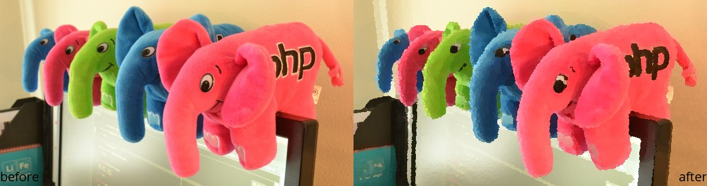

Creating a Custom Filter
========================

The main idea of using filters is to create your own custom filters. The built-in filters are just to give you an idea of how it works, and provide some basic effects.
The filters are usually resource-specific, which means they will work only with one specific image extension - now either **Imagick** or **GD**. But nothing prevents you checking
which extension is in use and do a different procedure for each one. You'll have access to the **Imanee** object, from which you can get the underlying resource used.

Let's have a look at the Black and White filter from Imagick (Imanee\Filter\Imagick\BWFilter):

.. code-block:: php

    class BWFilter implements FilterInterface
    {
        /**
         * {@inheritdoc}
         */
        public function apply(Imanee $imanee, array $options = [])
        {
            /** @var \Imagick $resource */
            $resource = $imanee->getResource()->getResource();

            return $resource->modulateimage(100, 0, 100);
        }

        /**
         * {@inheritdoc}
         */
        public function getName()
        {
            return 'filter_bw';
        }
    }

A closer look: ``$imanee->getResource->getResource();``

Notice that we call two times the method "getResource". This happens because the class **Imanee** doesn't have direct access to the real image resource in use (Imagick or GD) - it uses an object of
type ImageResource. The ImageResource interface defines the basic methods a resource needs to implement in order to be used by Imanee - for now we have two types of ImageResources: ``ImagickResource`` and ``GDResource``.

When you run ``$imanee->getResource``, you'll get an object of type ``ImagickResource`` or ``GDResource``, depending on which extension you are using. This object will also have its own
``getResource`` method, which will return the **real** image resource - either an object of type **Imagick** or a simple file resource that is used by **GD**.

Now let's implement our own Filter. Filters can do pretty much anything to an image, including opening new resources to apply on top of them.
To keep things simple, let's use Imagick and one of its *artistic* methods: `oilPaintImage <http://php.net/manual/en/imagick.oilpaintimage.php>`_ .
We'll name the filter "filter_oil".

Below, our custom filter class:

.. code-block:: php

    class TestFilter implements Imanee\Model\FilterInterface
    {
        public function apply(Imanee $imanee, array $options = [])
        {
            /** @var \Imagick $resource */
            $resource = $imanee->getResource()->getResource();

            return $resource->oilPaintImage(2.5);
        }

        public function getName()
        {
            return 'filter_oil';
        }
    }

And this is how we use it:

.. code-block:: php

    header("Content-type: image/jpg");
    $imanee = new Imanee(__DIR__ . '/img01.jpg');

    $imanee->addFilter(new TestFilter());
    echo $imanee->applyFilter('filter_oil')
        ->output();

This is the before/after:

See how easy it is? Now go build your own Instagram and have fun :)