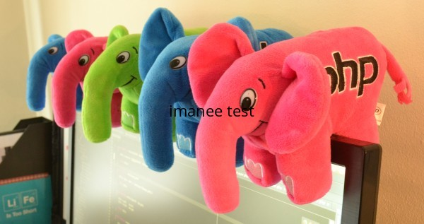
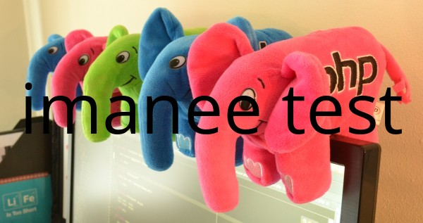
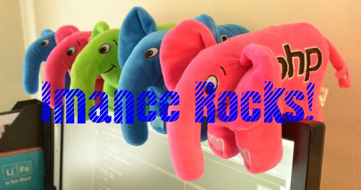

Writing Text
============

Using relative positioning
--------------------------

There are different methods for writing text with Imanee. The simplest way to do it is by using ``placeText``, because it uses a relative positioning - so you
don't need to calculate coordinates for text placement.

``Imanee Imanee::placeText($text, $place_constant = Imanee::IM_POS_TOP_LEFT, $fitWidth = 0, $fontSize = 0)``

By default, Imanee will use the included font *Open Sans* in a predefined Drawer object, but you can also provide your own Drawer object with custom options (including font file).

Basic usage example:

.. code-block:: php

    $res_jpg = __DIR__ . '/../resources/img01.jpg';

    header("Content-type: image/jpg");

    $imanee = new Imanee($res_jpg);
    echo $imanee
        ->placeText('imanee test', Imanee::IM_POS_MID_CENTER)
        ->output();

This will write 'imanee test' using the default Drawer settings, on top of the current image resource, centralized. Result:

For a reference on all available placement constants, have a look at the :ref:`Positioning Constants<constants-positioning>` manual page.

Now imagine you want your text to have a specific width, and you are not sure which font size would give you that.
No worries! You can use the argument ``fitWidth = x`` to define the width you want the text to fill:

.. code-block:: php

    $res_jpg = __DIR__ . '/../resources/img01.jpg';

    header("Content-type: image/jpg");

    $imanee = new Imanee($res_jpg);
    echo $imanee
        ->placeText('imanee test', Imanee::IM_POS_MID_CENTER, $imanee->getWidth()*0.9) // this will use 90% of the image width for the text, leaving some margins
        ->output();

And this is the result:

Using Coordinates
-----------------

If you'd prefer to define the exact coordinates for the text placement, or if you would like to add an angle to the text, you should use the method ``annotate`` instead.

``Imanee Imanee::annotate($text, $coordX, $coordY, $size = 12, $angle = 0)``

Keep in mind that the coordinates represent the bottom left point of the text - if you use, for instance, ``0,0`` as coordinates, the text
won't appear as the ``Y`` coordinate on zero will show nothing.

Basic usage example:

.. code-block:: php

    $res_jpg = __DIR__ . '/../resources/img01.jpg';

    header("Content-type: image/jpg");

    $imanee = new Imanee($res_jpg);
    echo $imanee
        ->annotate('imanee test', 10, 60, 20)
        ->output();

Setting the font and text color
-------------------------------

Imanee uses a default *Drawer* object, but you can customize all options by creating your own *Drawer*. Then, use ``setDrawer`` to change the default
 Drawer object, and you will be ready to use any of the text writing methods with your custom drawer settings:

.. code-block:: php

    $res_jpg = __DIR__ . '/../resources/img01.jpg';

    header("Content-type: image/jpg");

    $imanee = new Imanee($res_jpg);
    $drawer = new Drawer();
    $drawer
        ->setFont(__DIR__ . '/resources/almonte_wood.ttf')
        ->setFontColor('blue')
        ->setFontSize(100);

    $imanee->setDrawer($drawer);
    echo $imanee
        ->placeText('Imanee Rocks!', Imanee::IM_POS_MID_CENTER)
        ->output();

Generating text-only images
---------------------------

You can easily generate text-only images with the convenient static method ``textGen``.

``Imanee Imanee::textGen($text, Drawer $drawer = null, $format = 'png', $background = 'transparent')``

Example:

.. code-block:: php

    header("Content-type: image/png");

    $drawer = new Drawer();
    $drawer
        ->setFont(__DIR__ . '/resources/almonte_wood.ttf')
        ->setFontColor('blue')
        ->setFontSize(100);

    $text = Imanee::textGen('Imanee Rocks!', $drawer);
    echo $text->output();

Only the text is mandatory, but you normally will be creating a custom Drawer object to change things like font, color and size. By default it generates a PNG with
transparent background.

